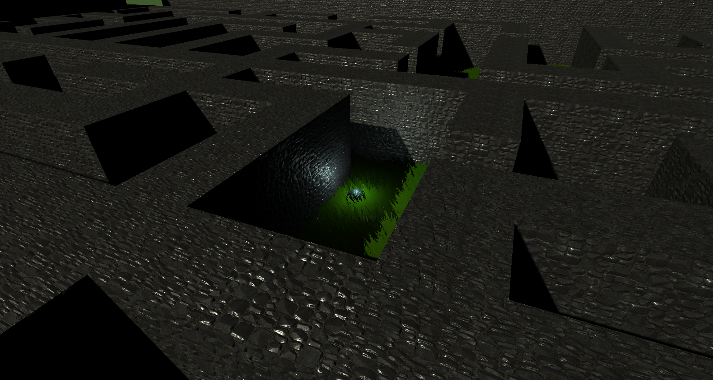
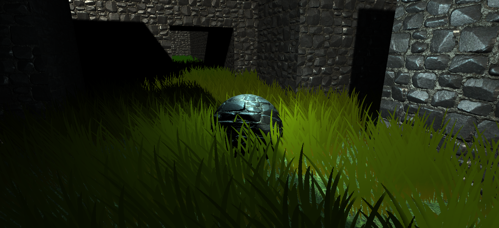
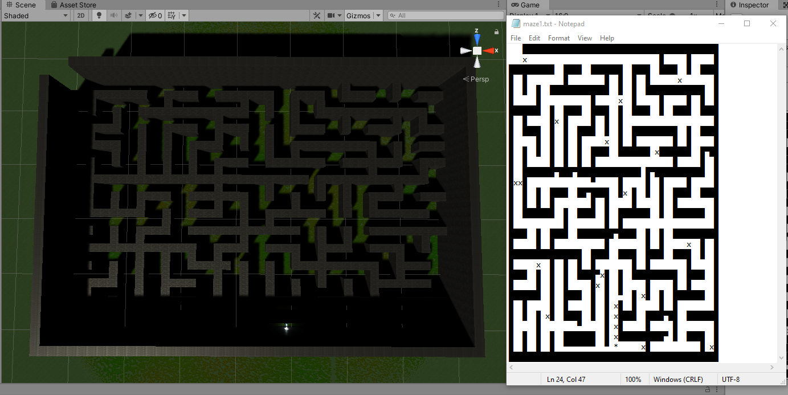
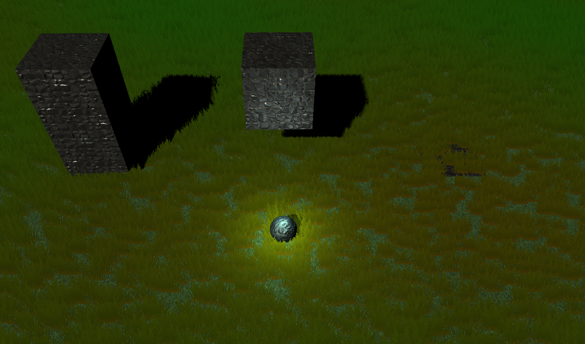
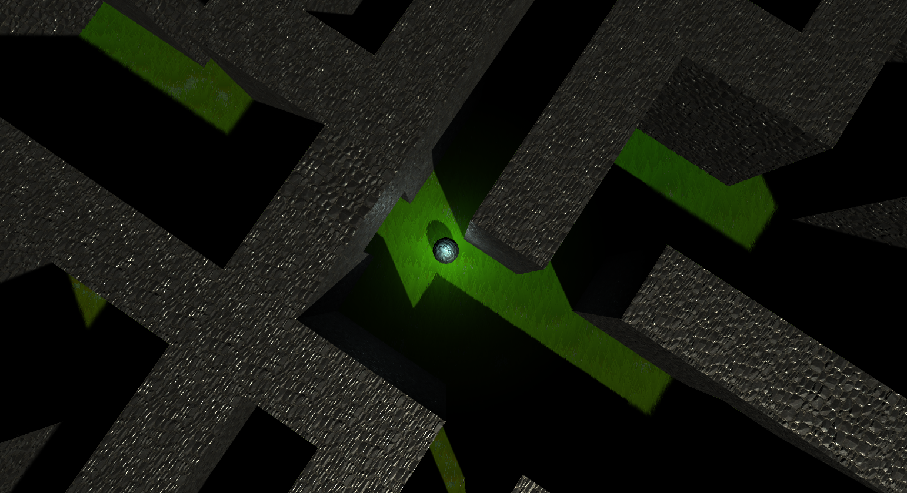
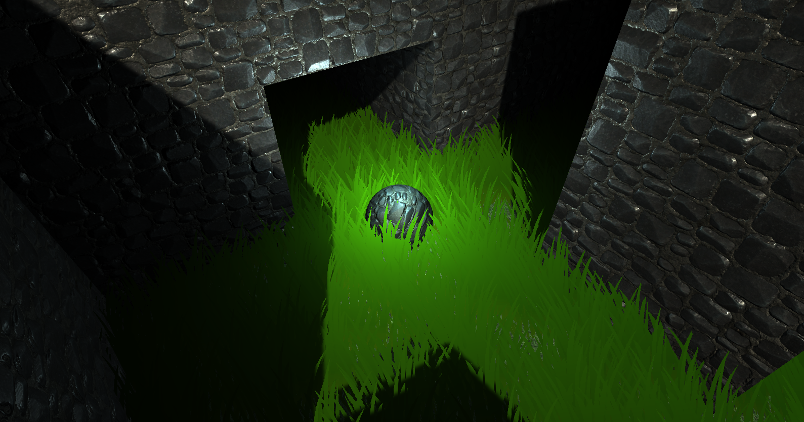
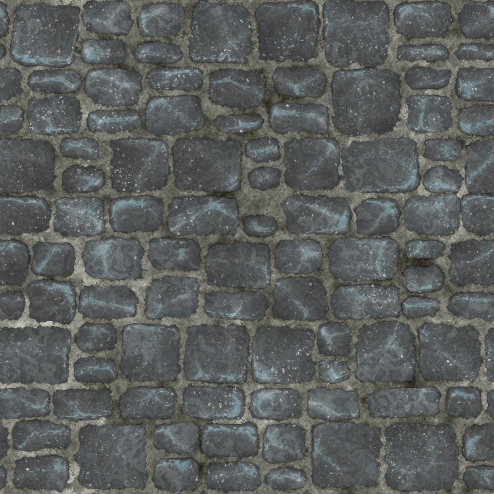
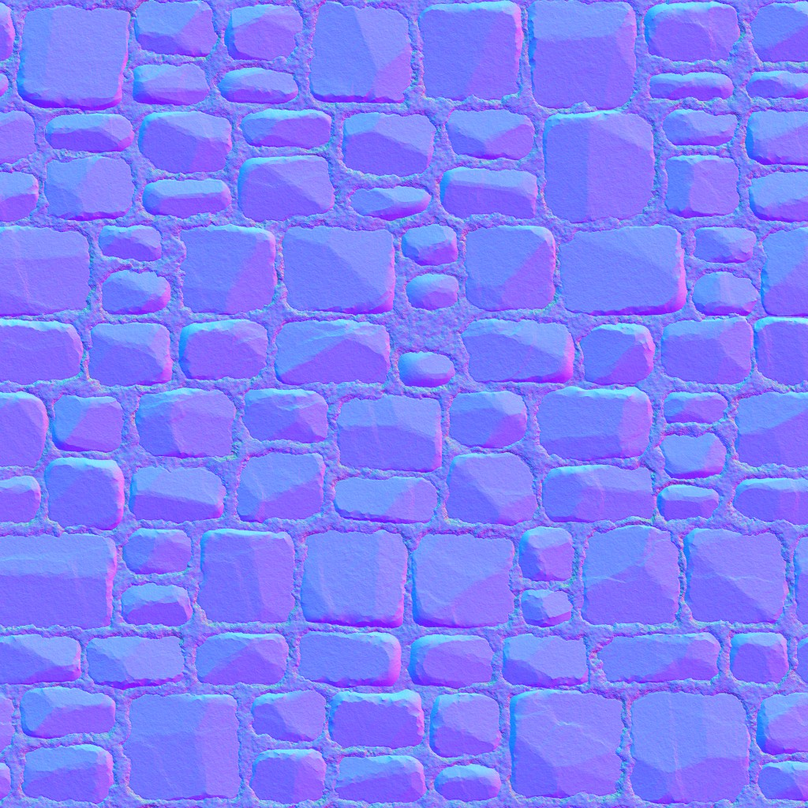
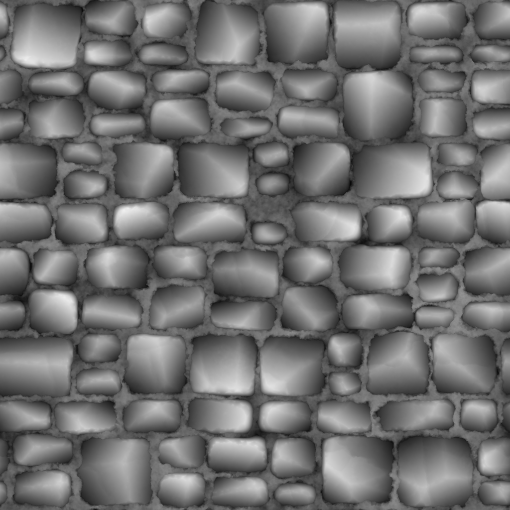

# simple-Unity-game

\

\
\
Gra polega na przejściu labiryntu generowanego na podstawie pliku tekstowego:
\
\

\
\
W grze występują 3 bloki: ściana wysoka (█), niska (▀) oraz pułapka (x):
\
\

\
\
Przykładowe zrzuty ekranu z rozgrywki:
\
\

\

\
\
Materiał każdego z bloków posiada mapę normalną oraz mapę wysokości:  

|  |  |  |
|-----------------------------------|-----------------------------------|-----------------------------------|

\
Poza poruszaniem graczem (WSAD) oraz kamerą (ruch myszki) zaimplementowany został system unikania kolizji kamery z obiektami: obiekt (gracz) zawsze będzie widoczny.

## Filmy 
* [Bump mapping](https://drive.google.com/file/d/1ZkmI83RbI6XpTiDHjogiVJ1BQHimOlXl/view?usp=sharing)
* [Unikanie kolizji](https://drive.google.com/file/d/15dY9f2fY8lUrAELRsmsiSyUtqV0akpRv/view?usp=sharing)
* [Działanie pułapki](https://drive.google.com/file/d/1ecXHRgmkctksZoC1tWcJ99XbPcDVoiiD/view?usp=sharing)
